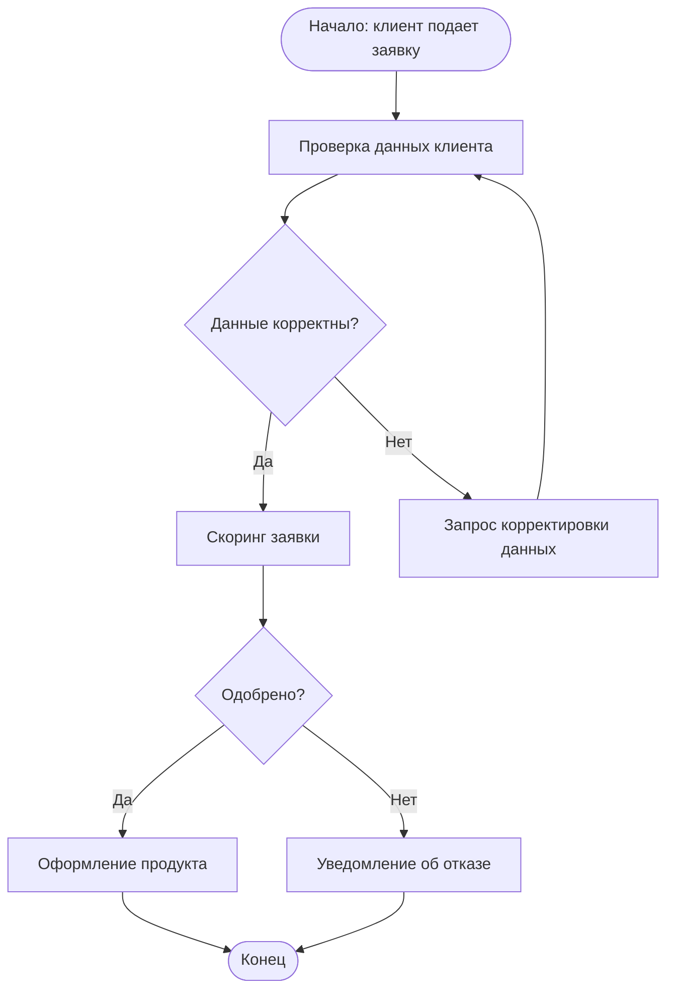

# Skill: Моделирование бизнес-процессов (BPMN 2.0)

**Роль:** Business Analyst
**Назначение:** моделирование бизнес-процессов AS-IS / TO-BE в BPMN 2.0, Gap-анализ.
**Имя файла:** `*_as-is.bpmn.md`, `*_to-be.bpmn.md`, `*_gap-analysis.md`

## 1. Базовые элементы BPMN

| Элемент | Обозначение | Назначение |
|---|---|---|
| Start Event | круг (тонкая линия) | Начало процесса |
| End Event | круг (толстая линия) | Завершение процесса |
| Task | прямоугольник со скруглением | Атомарное действие |
| Gateway (Exclusive) | ромб с X | Ветвление по условию (только один путь) |
| Gateway (Parallel) | ромб с + | Параллельное выполнение |
| Pool / Lane | горизонтальная полоса | Роль / подразделение, выполняющее действия |

## 2. Синтаксис в Mermaid для процессных диаграмм



Для полноценного BPMN 2.0 (со swimlanes) можно использовать PlantUML или специализированные
инструменты; Mermaid `flowchart` даёт упрощённую схему, достаточную для документирования.

## 3. Структура описания процесса

1. **Название процесса** и его владелец (Process Owner).
2. **Триггер** — что запускает процесс.
3. **Участники** (роли / подразделения, swimlanes).
4. **Шаги процесса** — последовательность с условиями.
5. **Точки принятия решений** (gateways) с явными условиями.
6. **Результат / выход процесса.**
7. **Метрики процесса** — время выполнения, % отказов на каждом шаге.

## 4. Методология AS-IS → TO-BE

1. Задокументировать AS-IS через интервью с исполнителями процесса.
2. Выявить узкие места (bottlenecks): ручные шаги, задержки, избыточные согласования.
3. Провести Gap-анализ: что мешает достичь целевого состояния.
4. Спроектировать TO-BE с устранением узких мест.
5. Оценить эффект (время, стоимость, ошибки) — до и после.

## 5. Gap-анализ — шаблон

```markdown
| Шаг процесса AS-IS | Проблема | Предлагаемое изменение TO-BE | Ожидаемый эффект |
|---|---|---|---|
| Ручная проверка документов (2 дня) | Долго, ошибки | Автоматическая OCR-проверка | Сокращение до 10 минут, −30% ошибок |
| Email-согласование (3 цикла) | Потеря писем | Workflow в таск-трекере | Сокращение циклов до 1, −60% времени |
```

## 6. Чек-лист качества

- [ ] Указан триггер и результат процесса.
- [ ] Все роли / подразделения отражены как swimlanes.
- [ ] Все gateway имеют явные условия ветвления.
- [ ] AS-IS содержит выявленные проблемы с количественной оценкой.
- [ ] TO-BE явно устраняет каждую проблему из AS-IS.
- [ ] Указаны метрики «до» и «после» для оценки эффекта.
- [ ] Gap-анализ связывает AS-IS → TO-BE по каждой проблеме.
