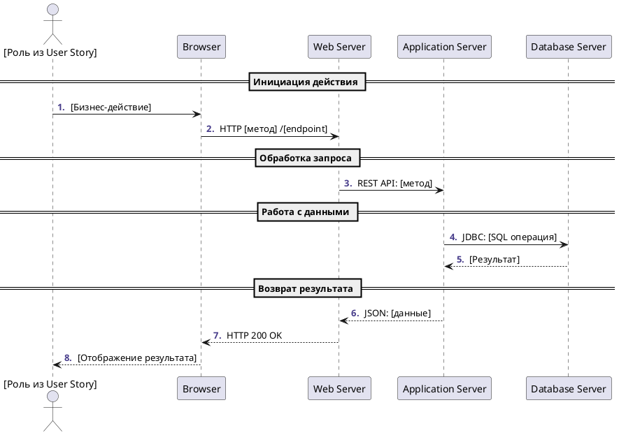

# Skill: Sequence-диаграмма

**Роль:** System Analyst
**Назначение:** создание Sequence-диаграмм в PlantUML.
**Имя файла:** `*_sequence.plantuml`

## Содержание
1. Основы и требования
2. Структура диаграммы
3. Метрики качества
4. Валидационные правила
5. Базовый шаблон
6. Типы взаимодействий
7. Интеграция с артефактами
8. Стандартные этапы
9. Обработка ошибок
10. Чек-лист качества

---

## 1. Основы и требования

### Обязательные входные артефакты
- **User Story** — для понимания бизнес-сценария.
- **Use Case** — для детального потока взаимодействий.
- **Архитектурная диаграмма** — для участников и связей.

### Дополнительные артефакты
- API-документация, техническая спецификация, диаграмма развёртывания.

---

## 2. Структура диаграммы

### Заголовок и настройки
```plantuml
@startuml
autonumber "<b><color:DarkSlateBlue>.</color></b> "
```

### Участники (строгая типизация)
```plantuml
actor User as "Роль из User Story"
participant Browser as "Browser"
participant "Web Server" as WebServer
participant "Application Server" as AppServer
participant "Database Server" as DBServer
```

### Группировка этапов
```plantuml
== Название логического этапа ==
```

### Взаимодействия с протоколами
```plantuml
User     -> Browser   : Бизнес-действие
Browser  -> WebServer : HTTP GET/POST /endpoint
WebServer-> AppServer : REST API: метод
AppServer-> DBServer  : JDBC: SELECT/INSERT
```

---

## 3. Метрики качества

### Целевые показатели
- **Покрытие участников:** 100% из архитектурной диаграммы.
- **Логическая группировка:** 3–7 этапов с понятными названиями.
- **Детализация протоколов:** 90% взаимодействий с указанием технологии.
- **Обработка ошибок:** минимум 2 альтернативных сценария.

### Система оценки
- **Отличное:** ≥ 90%.
- **Хорошее:** 70–89%.
- **Требует доработки:** < 70%.

---

## 4. Валидационные правила

- Начинается с `@startuml`, заканчивается `@enduml`.
- Роль актора соответствует User Story.
- Участники присутствуют в архитектурной диаграмме.
- Каждый этап имеет название в формате `== Название ==`.
- Протоколы указаны для технических взаимодействий.
- Синхронные/асинхронные стрелки используются корректно.
- Есть минимум 1 альтернативный поток (`alt`/`opt`/`loop`).

---

## 5. Базовый шаблон



---

## 6. Типы взаимодействий

### Протоколы и синтаксис

| Тип | Синтаксис | Пример |
|-----|-----------|--------|
| **HTTP** | `HTTP [метод] /endpoint` | `HTTP GET /api/users` |
| **REST API** | `REST API: [операция]` | `REST API: getUserData` |
| **База данных** | `JDBC: [SQL]` | `JDBC: SELECT * FROM users` |
| **Message Queue** | `MQ: [операция]` | `MQ: publish userCreated` |
| **gRPC** | `gRPC: [метод]` | `gRPC: GetUserProfile` |

### Типы стрелок
- `->` и `-->` — синхронные вызовы/ответы.
- `->>` и `-->>` — асинхронные вызовы/ответы.
- `->` на себя — внутренняя обработка.

### Управляющие конструкции
```plantuml
alt Успешный сценарий
    // основной поток
else Ошибка
    // обработка ошибки
end

opt Условное выполнение
    // опциональные действия
end

loop Повторение
    // циклические действия
end
```

---

## 7. Интеграция с артефактами

### Связь с User Story
- Актор диаграммы = роль из US.
- Основной поток = описание действий из US.
- Результат = ожидаемая выгода из US.

### Связь с Use Case
- Основной сценарий UC = главная последовательность.
- Альтернативные потоки UC = `alt`/`opt` блоки.
- Исключения UC = error handling блоки.

### Связь с архитектурой
- Участники sequence = компоненты из архитектуры.
- Взаимодействия = связи между компонентами.
- Протоколы = технологии интеграции.

---

## 8. Стандартные этапы

### Типовые группы
1. **Инициация:** «Пользователь инициирует действие».
2. **Аутентификация:** «Проверка прав доступа».
3. **Валидация:** «Проверка входных данных».
4. **Обработка:** «Бизнес-логика и вычисления».
5. **Сохранение:** «Работа с базой данных».
6. **Уведомления:** «Отправка сообщений».
7. **Ответ:** «Возврат результата пользователю».

### Примеры конкретных названий
- `== Загрузка списка заказов ==`
- `== Проверка корректности платежных данных ==`
- `== Формирование отчета по продажам ==`

---

## 9. Обработка ошибок

### Обязательные сценарии ошибок
```plantuml
alt Успешное выполнение
    AppServer -> DBServer : SELECT query
    DBServer --> AppServer : Data returned
else Ошибка подключения к БД
    AppServer -> DBServer : SELECT query
    DBServer --> AppServer : Error: Connection timeout
    AppServer --> WebServer : HTTP 500 Internal Error
    WebServer --> Browser : Страница ошибки
else Ошибка валидации данных
    AppServer -> AppServer : Validate input
    AppServer --> WebServer : HTTP 400 Bad Request
    WebServer --> Browser : Сообщение об ошибке
end
```

---

## 10. Чек-лист качества

**Структурная проверка:**
- [ ] Файл начинается с `@startuml` и заканчивается `@enduml`.
- [ ] Используется `autonumber` для нумерации шагов.
- [ ] Актор соответствует роли из User Story.
- [ ] Все участники есть в архитектурной диаграмме.

**Логическая проверка:**
- [ ] 3–7 логических этапов с понятными названиями.
- [ ] Последовательность шагов соответствует Use Case.
- [ ] Есть альтернативные потоки (`alt`/`opt`/`loop`).
- [ ] Обработка минимум 2 типов ошибок.

**Техническая проверка:**
- [ ] Протоколы указаны для всех технических вызовов.
- [ ] HTTP-методы и endpoints конкретизированы.
- [ ] SQL-операции детализированы.
- [ ] Синхронные/асинхронные вызовы корректны.

**Интеграционная проверка:**
- [ ] Соответствие основному сценарию Use Case.
- [ ] Покрытие всех акторов из архитектуры.
- [ ] Технические детали соответствуют API-спецификации.

**Цель:** создавать Sequence-диаграммы, готовые для технической реализации и тестирования.

---

## 11. Рекомендации по стилю

### Именование
- **Акторы:** конкретные бизнес-роли.
- **Участники:** архитектурные компоненты.
- **Сообщения:** бизнес-термины для пользователей, технические для систем.

### Детализация
- **Краткость:** сообщения до 50 символов.
- **Ясность:** понятная терминология.
- **Последовательность:** логический порядок вызовов.
- **Группировка:** объединение связанных действий.

### Примеры качественных описаний
✅ `HTTP POST /api/orders - создание заказа`
✅ `JDBC: INSERT INTO orders (user_id, total)`
✅ `Отображение страницы подтверждения заказа`

❌ `Делает запрос`
❌ `Возвращает данные`
❌ `Система обрабатывает`
